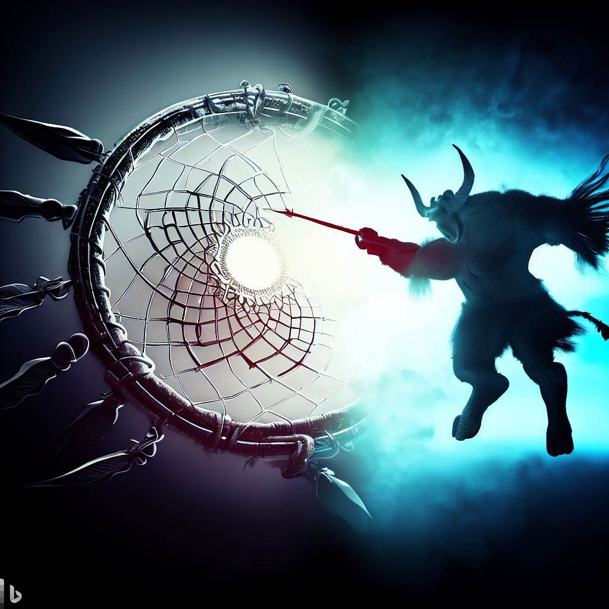

_"Packetisation in the Dreamcatcher vs Decentralised Autonomous Organizations"_

<!--truncate-->

Packetised innovation, as exemplified by platforms like Dreamcatcher, offers several advantages over a Decentralised Autonomous Organization (DAO). The model of packetised innovation directly links economic rewards to the value of contributors' input, encouraging everyone to work towards a common goal with the same incentives. It is open to anyone, anywhere, without requiring permission, incentivising high-quality contributions in a barrier-free environment. This process is streamlined by dealing in 'Packets' - unitary pieces of software or knowledge whose quality is verified by a trusted QA and which address a specific need.

Moreover, the Dreamcatcher platform ensures all members can easily ascertain whether a Packet is 'done' or 'not done,' reducing cost and ambiguity for all involved. The Packets act like immutable equity that cannot be diluted or taken away and are owned by all members who contributed to their creation. They can be traded and can generate revenue streams, ensuring that those who contributed get rewarded. Importantly, these Packets can be re-used in many applications and improved along the way, speeding up development and offsetting costs while providing a passive income stream for original contributors.

In contrast, while DAOs also operate on principles of decentralisation and transparency, they typically rely on voting mechanisms and workflows for decision-making and control. DAOs, although innovative in their organisational structure, can be hindered by slower decision-making processes due to the requirement of consensus from all members. Additionally, participation in DAOs may be limited to accredited investors only, potentially creating a barrier to entry.

In summary, packetised innovation allows for more direct, efficient, and inclusive contribution, fostering innovation and value creation while potentially avoiding some of the limitations inherent in DAO structures.