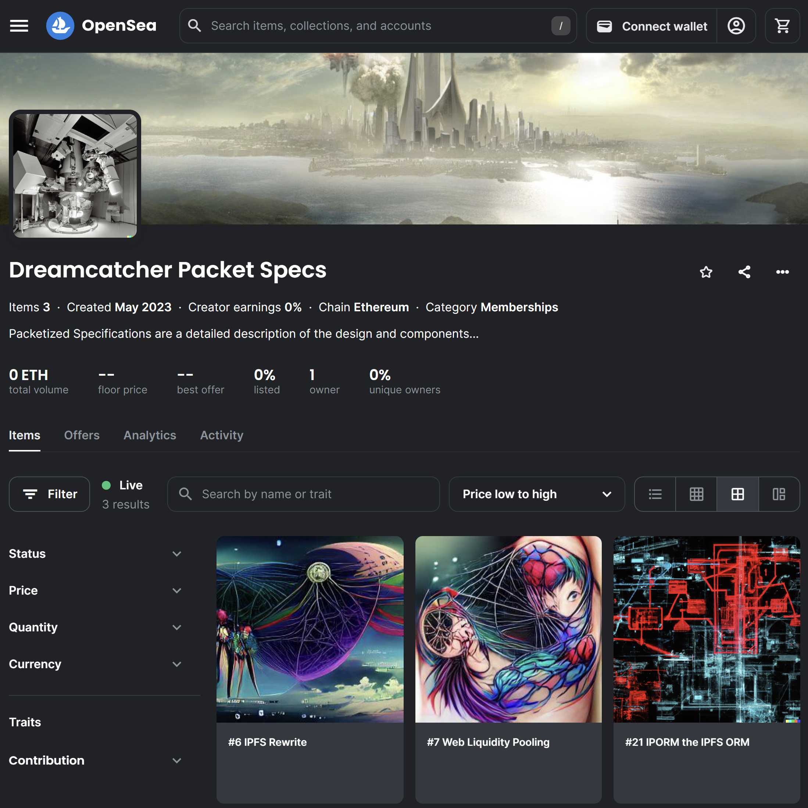

_"Funding the Dreamcatcher: A Model for venture funding an AI powered Innovation network"_

<!--truncate-->

Dreamcatcher is an innovation network built on the confluence of blockchain, Non-Fungible Tokens (NFTs), and artificial intelligence (AI) to coordinate and incentivize contributors in a fair and transparent manner. The system brings together workers, investors, and existing technologies to expedite market solutions for customers, reducing time-to-market and enabling efficient utilization of global talent.  The AI is authoritative in determining attribution for contribution, and is made auditable by running natively on blockchain, avoiding hand crafted business models for each and every application, instead focusing on pure utility.

## Components and Functionality

The Dreamcatcher system consists of three integral components:

1. **Dreamcatcher Blockchain**: A high compute capacity blockchain that operates on the principle of object-oriented programming with one blockchain per object. Each chain, capable of running on multiple computers, operates independently, enabling massive parallelism.  With this intense on-chain computation ability, blockchain native AI models can be run.  The blockchain ensures trust, transparency, and privacy, with data encryption at rest and in transit.

2. **Dreamcatcher Protocol**: This protocol transforms work tasks into NFTs, decentralizing the work management model and making it accessible to the global talent pool. The protocol initiates with the definition of a task (referred to as a Packet), followed by independent QA review. Once approved, the Packet opens for funding, with the proceeds held in escrow until a suitable solution is proposed and approved.  These NFTs are available for trade on OpenSea and other marketplaces as shown in the adjacent figure.

3. **Dreamcatcher AI**: Trained on the protocol dataset and running natively on the blockchain, the Dreamcatcher AI fairly attributes to contributions based on interactions recorded in the NFTs. Continuous protocol data further adjusts and refines the decentralized AI's decisions, ensuring consistent and accurate contribution tracking, even as societal awareness of fairness evolves.

## Value Proposition

Dreamcatcher inverts the work-value interaction by externalizing tasks into discrete, competitive NFTs, labeled "Packets". This decentralized model emphasizes productivity, tying compensation directly to useful results. Packets, organized akin to a gantt chart, offer management direct control over budget and timelines. 

Dreamcatcher's AI serves as the default business model, attributing payments to contributors based on NFT-recorded contributions. This obviates the need for costly and often flawed self-devised business models, focusing on maximal customer utility instead. The AI also projects future NFT worth, incentivizing continual software maintenance.

Publicly available NFTs enable task identification and combination across organizations, maximizing funding and royalties while expediting project completion. Furthermore, Dreamcatcher expands funding opportunities, promoting a globally participative and innovative workforce, contrasting with traditional, insular internal company funding.

## Future Development and Funding

Dreamcatcher's challenges involve the AI development for fair attribution, the blockchain extension to handle this new workload, but most of all scalable network growth of participants.  Starting a public company to raise additional funding will boost talent acquisition via increased packet funding, enhance publicity, and establish legitimacy. The stock offers an investment opportunity for those preferring financial contribution over active task involvement. As the public company accrues balance sheet income from the Dreamcatcher and reports NFTs as assets, analysts can predict future company stock value, promising favorable returns for investors.  Our initial partnerships will be focused around Satoshi Island - a blockchain native smart city initiative, as the success of members is the most important aspect of the Dreamcatcher’s success.

Much like the Internet, the Dreamcatcher's full impact is largely unpredictable, with its usage and evolution firmly in the hands of its global community - it will be defined more by what gets done with it than how it was built.  We hope it will appear over time as though the Internet finally developed a brain, with the humans supplying novelty, and the Dreamcatcher AI ensuring a fair and cooperative environment for them to rapidly collaborate in real time with near zero friction commerce.

If we can get the most basic version of the Dreamcatcher operating with the elements described herein, the long term result should be a displacement of other blockchains, as the winner in any environment is that which can evolve.  The Dreamcatcher is built as though it was evolution itself, endlessly reinforcing its valuable parts, discarding that which it no longer needs.  These evolutionary forces are external in other blockchain ecosystems, and give them a fatal weakness.  Should the Dreamcatcher manage to take hold in the far-from-over blockchain race and additionally in the just-getting-started AI race, the perpetual royalties fairly due to the early contributor NFTs ought to be significant.
