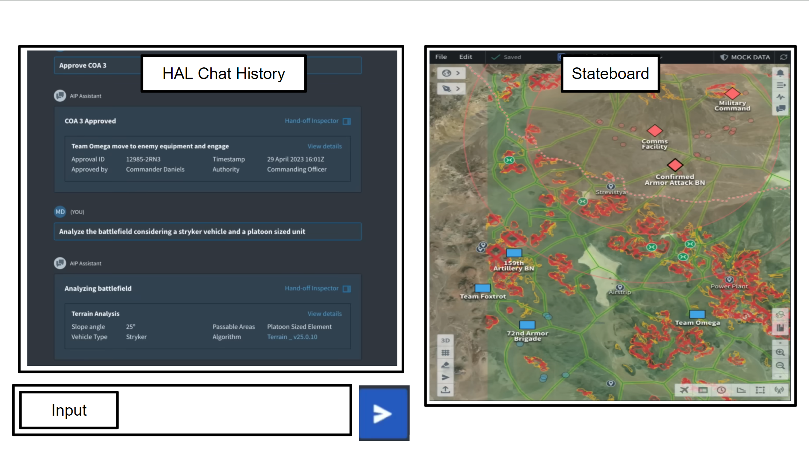
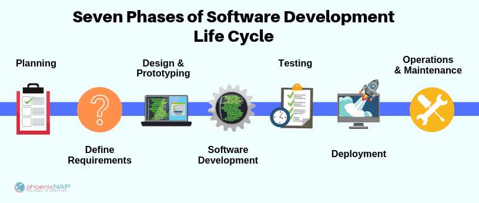

_"Delivering the Dreamcatcher: AI Assembled Applications Just In Time"_

<!--truncate-->
 

> **It isn't what you don't know that gets you, it's what you know for sure that just ain't so**
>
> _Software engineers when GPT4 passed the Turing Test_

Since 1950, the [Turing Test](https://en.wikipedia.org/wiki/Turing_test) has been a benchmark in our efforts to develop intelligent machines. Recently, it has been surpassed, suggesting we might need to rethink our ideas about how we create and use computational technology.

In the past ten years, there has been an increase in the use of applications and what these applications can do. However, software construction efficiency has not advanced nearly as much. Our blockchain application framework was designed to make programming less complex, but it didn't address how to make communication between people building the software more efficient.

We are now shifting from a static to a dynamic application delivery model.

Here, AI assembles applications just in time, tailored to the user's instantaneous needs. Our blockchain makes programming less complex, so in some cases the AI can do that programming in real-time. By complete accident, the API for our blockchain is exactly the API OpenAI has chosen for letting GPT4 make API calls, meaning we can integrate AI with no translation. In response, we have named our blockchain framework Artifact, as it is that which the AI leaves behind.

If a program is both delivered and coded in natural language, this reduces the distance between developers and users, letting users more directly engage with the system without the usual hindrance of the software industry.

## Changes to the application delivery model

Just-In-Time AI assembled applications - hereby refered to as 'Jitters' - are delivered in a single application, where user interaction is by natural language discourse with an AI assistant.
The single application is called Dreamcatcher, and the AI assistant is called HAL.

Jitter delivery differs from conventional delivery as follows:

**From applications to components** A single application that dynamically adapts empowers users to continuously tailor systems to their needs by composition, which encourages Jitter components to be modular and compatible.

**Real-time lifecycle** A single application with just in time composition allows enhancements to Jitters to be enjoyed within seconds, instead of months, and to be integrated continously rather than via separate update processes and release cycles for each application

**Unification of Delivery** A single delivery conduit supersedes the need for a conventional app store, as HAL scours for necessary components on-the-fly. A single billing arrangement can be made with the user, as well as a single authentication challenge, giving the user complete control of all data and AI interactions.

**3 box UI** The Dreamcatcher is presented with only three windows: chat input, chat history, and a stateboard. The dynamic AI controlled rendering of the stateboard ensures optimal data presentation, adapting in real-time to user interactions.

An example of this interface design taken from Palantir is shown here:

This is a breakdown of the essential elements of the interface:

A video example of this interface design can be seen [here](https://www.youtube.com/watch?v=XEM5qz__HOU) in use for the US military, which we found during a competitor search.

## Contrast to the software industry

Fred Brooks' seminal doctrine on software construction efficiency argues:

> **There is no single development, in either technology or in management technique, that by itself promises even one order-of-magnitude improvement in productivity, in reliability, in simplicity**
>
> _Fred Brooks - No Silver Bullet - 1986_

We challenge this notion in the post Turing Test world.

### The Old Way (months long)

This process would typically take weeks or months to cycle through and adapt to whatever changes had occured or been discovered since initiation, and the cost is typically high since human labour is required. The output is usually wrong in some way, and often not aimed at a single specific user request due to economic infeasibility.

### Just In Time (seconds long)

In the Dreamcatcher, this whole cycle is managed by AI in very small chunks, at the instant the user wants something. Cycle time is measured in seconds, and cost is typically less than a cent per loop. However not every user request can be solved by HAL, and so when the system gets stuck on something, a broader innovation cycle is required involving a network of incentivized human innovation

## The Innovation Network

The Innovation Network within the Dreamcatcher is engaged whenever HAL gets stuck on something. It happens both silently in the background, or actively in conversation with the user about their needs. It works as follows:

1. **A Stuck as the Unit of Innovation**:
   When HAL identifies that it is genuinely stuck in its service to the user, it creates an object out of it, named a "Stuck". These are NFTs on a public blockchain, and embody a problem within the Dreamcatcher. Stucks are valuable, as a high quality problem statement is the critical step in getting a high quality solution.
1. **Funding as incentivization** Knowing that HAL has already vetted a Stuck as being unique, humans can put funding against a Stuck to incentivize its solution, and HAL helps advertise the problem to those best suited to solve it.

1. **Integration within Jitters**:
   Once solved, HAL verifies the solution, the funds are dispersed, and the solution is immediately available to be incorporated into Jitters. Once it gathers traction within Jitter use, consumption payments start to flow to the contributors of the Stuck.

1. **Innovation becomes a Collective Endeavor**:
   The decentralized and AI integrated nature of the Innovation Network fosters a collective endeavor towards problem-solving. It makes users a collaborative part of continuous improvement, with an openness that should outperform closed innovation.

## Funding, Pricing, and Revenue

The economic heart of this system is an AI powered, dynamic, ethical and fair machine that attributes to all who contribute. It sets the price paid for consumption, and says who receives the dispersal of each payment.

The transparency of blockchain enables trust, and the data processing power of AI allows it to consider all forms of contribution, which is a dataset too large for any human to parse effectively, and is a task too politically charged for any human to rule on without bias.

This is the Ambient Attribution System.

### Funding Stucks

The only type of funding in the system is escrow of funds against a Stuck to incentivize a solution. Once the Stuck is resolved, the funding is sent to the contributors, and the funding contribution is recognized in perpetuity. The contributions from the funders and solvers of Stucks form the sell side of the Stucks market.

### Pricing Model:

Setting the price of consumption of Jitters is a difficult and delicate subject. The just in time nature prohibits a manual pricing model, and so the automated version necessary for operation is provided:

#### **Dynamic Pricing**:

Setting the buy side price flexibly is crucial for fostering a fair environment conducive to maximal growth and economic throughput. The rewards received for a contribution change as more is learned about the true value that has been delivered.

#### **Ethical and Fair Pricing**:

Ambient Attribution is calibrated to ensure ethical and fair pricing, functioning as a transparent and sensitive arbiter in determining pricing. Getting this right will result in maximal possible economic growth.

### Revenue Streams:

In the Dreamcatcher, when financial transactions take place, Ambient Attribution clearly and traceably allocates the transaction's value among the resolved Stucks. This process turns resolved Stucks into an asset that can be traded, with its value based on future potential. There are three primary ways money can flow into the Dreamcatcher:

1. **Computational Usage**:
   Dreamcatcher is an AI heavy application and requires fees to be able to run. We will start by marking up this charge, and attributing by way of Ambient Attribution to all the contributors that enabled the operation.

2. **Transaction fees upon Stuck Resolution**:
   When a Stuck is resolved, a portion of the dispersed funds will be due to the Dreamcatcher. These fees are expected to be around the 5% mark, depending on what the Ambient Attribution computes as a fair cut.

3. **HAL facilitated value exchange**:
   With HAL as a personal assistant, entities operating within the Dreamcatcher participate in deals brokered by AI, and employ Ambient Attriution to ensure pricing and attribution in those deals, in real-time. This seamless trading environment faintly looks like an Uberisation of everything.

## Conclusion

The Dreamcatcher, with its applications that adapt just in time, flexible pricing, and its network for fostering new ideas, blurs the line between users and developers, turning every interaction into a chance for tailor-made enhancements.

The flexible AI calculated pricing strategy promotes balanced growth with permissionless participation by providing fairness and clarity, making sure that everyone contributing is responsibly attributed to.

This approach turns every user into a prospective developer, with AI and blockchain technology facilitating immediate customization and new developments, while also ensuring fair payment for everyone's input. Here, applications are living, evolving entities, and problems therein are merely the starting points to further innovation.

## Dictionary

These are the terms introduced here:

**Jitters** Applications assembled just in time by AI - brings the ability to deliver a feature a user asked for unforeseen by the developers, without any software release lifecycle

**Stucks** Units of innovation - either open and needing to be done or resolved and usable in jitters. Represented as NFTs and can be funded and traded. They are the target of attribution payments calculated by Attribution.

**Stuck NFT** A Stuck that was considered important enough to expend gas on an ethereum compatible chain to turn it into an NFT which can be funded and traded

**The Stucks Loop** The innovation process where things that are stuck are turned into NFTs and worked on in a distributed fashion, and funded in a distributed way. Ambient Attribution disperses usage payments to the Stucks that the Jitter consumed to deliver value.

**AINode** An AI capable node - each blockchain object is natively AI capable - this is the atomic unit of composition to assemble jitters

**Artifact** The name for the blockchain framework we have developed that supports running AINodes with compute resources such as cpu, gpu, storage, networking, and consensus. It also provides side effect abilities to interface with external systems. It is that which the AI leaves behind.

**HAL** This is the name of the AI assistant that the Dreamcatcher presents as the primary means of intelligent interaction. All the resources of the Dreamcatcher are accessed via HAL.

**Pricing Model** A fair and transparent AI system that computes the price of any consumption or trade based on a personalized comprehensive analysis of the value generated based on the transaction.

**Ambient Attribution** A fair and transparent AI system that allocates payments to contributors within the Innovation Network based on a comprehensive analysis of their involvement in generating the payment.
