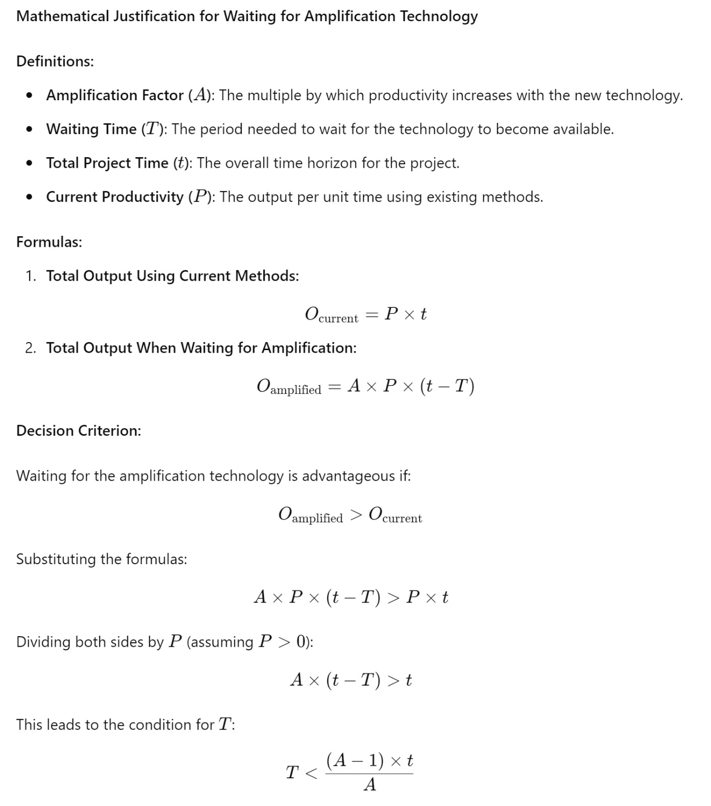
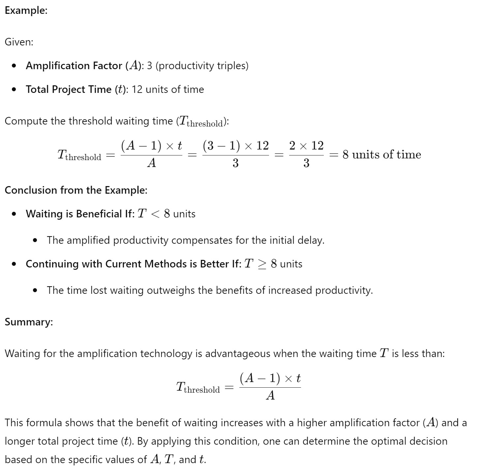
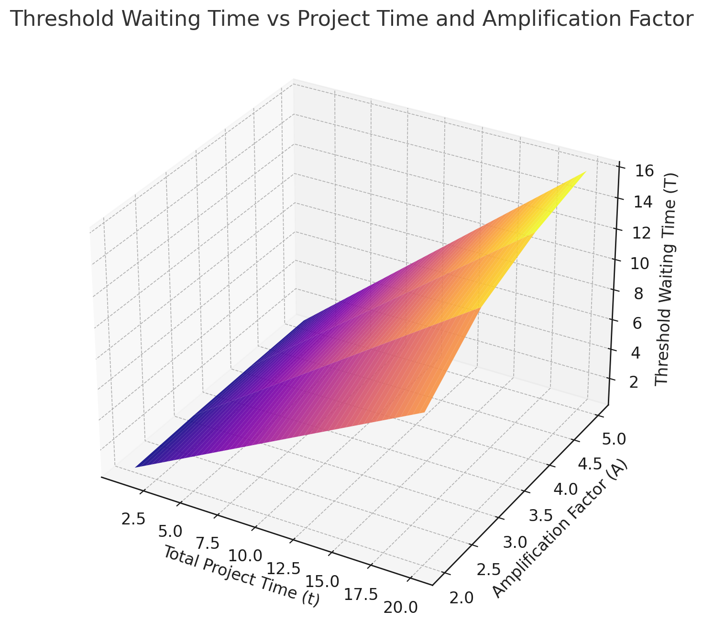

_"Hurry up and wait: The coming amplification of human effort"_

<!--truncate-->
 

I have attempted to express our waiting strategy in a formula. Waiting is almost
never the right choice, but we are looking at a once in a lifetime amplification
of effort. The below formula then applies:

As an example for a 12 month project, waiting makes sense anywhere up to 8
months, if we consider an amplication factor of 3:

However I think our amplification will be more like 10x or higher, since we will
be amplifying the number of humans we can command, and they will
be amplified also.

I'm not sure how to accurate express that type of interdependent amplification,
but its large, anyways. This is why we think it is best to focus solely on
getting the amplification tooling working for ourselves first, then leverage
that to do other tasks.

From this graph, the amplification factor isn't nearly as dominant as both the
time to wait for the amplification to arrive and the total project time for the
intended use of the amplification. Hence why doing nothing else but getting the
amplication tooling working seems best, and given that we have many projects we
can target with it, of varying time frames, there is almost no delay for the
tooling that isn't worth waiting for, especially in the variances we are
expecting, which worst case another 6 months worth of revisions, which
seems highly unlikely
